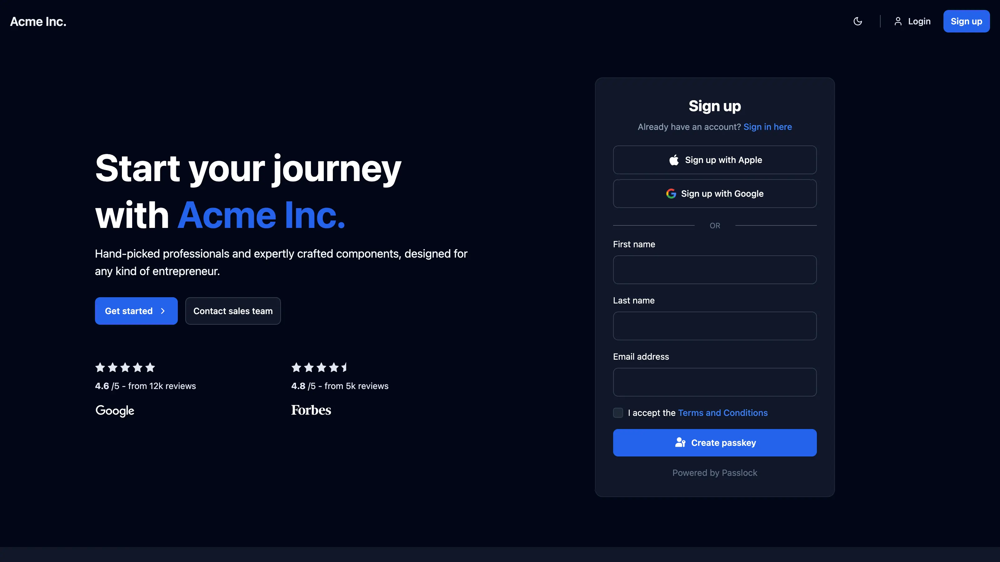
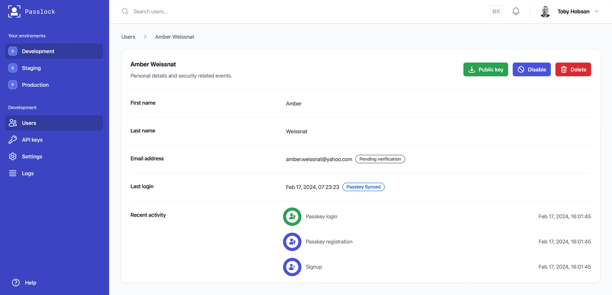

<!-- 
The pnpm script build:readme replaces tokens 
in README.template.md and outputs to README.md
-->
<div align="center">
  <a href="https://github.com/passlock-dev/passlock">
    
  </a>
</div>

<h1 align="center">Passkeys, Social Login & More</h1>

<a name="readme-top"></a>
<div align="center">
  <picture align="center">
    <source srcset="https://passlock-assets.b-cdn.net/images/client-repo-banner.dark.svg" media="(prefers-color-scheme: dark)" />
    
  </picture>
  <p align="center">
    Typescript library for next generation authentication. Passkeys, Apple login, Google one-tap and more..
    <br />
    <a href="https://passlock.dev"><strong>Project website »</strong></a>
    <br />
    <a href="https://d1rl0ue18b0151.cloudfront.net">Demo</a>
    ·
    <a href="https://docs.passlock.dev">Documentation</a>
    ·
    <a href="https://docs.passlock.dev/docs/tutorial/introduction">Tutorial</a>
  </p>
</div>

<br />

> [!NOTE]  
> **V2 coming soon!** I'm currently working on v2 of the Passlock framework. This will offer a finer-grained feature set, in particular the ability to manage passkeys and social logins independently of user accounts. More info below...

## Passlock v2

Developers never get it right first time! Based on valuable feedback and my own experience, I've realised the features need to more fine-grained. The major limitation with v1 is the requirement to create a Passlock user alongside a passkey or social login. This results in a few challenges:

1. The requirement to supply Personally Identifiable Information (PII) when creating a passkey.
2. The inability to link accounts or authenticators (without hacks).
3. A tight coupling between Passlock and the **R**elying **P**arty (your app).

### Standalone authenticators

With this in mind I've been working on v2, which essentially breaks the one to one link between authenticators (passkeys, social logins etc) and user accounts. v2 will allow you to:

1. Create a standalone passkey or other authenticator. 
3. Associate authenticators with local user accounts at the RP level. i.e. you will maintain the join table linking passkey id with a local user id.
3. _Optionally_ manage user accounts in Passlock, linking multiple authenticators to a single account.

### Other changes

Mailbox verification is not directly related to authenication and will be dropped. In it's place, I'm introducing email one time codes. I've found that one time codes togther with passkeys are a great way of delivering secure, yet frictionless account registration and authentication.

I'm dropping support for the various SvelteKit templates. The majority of code, and therefore ongoing maintenance is unrelated to Passlock or authentication in general. No template is able to encompass all the features and technology choices available in a modern app. Instead, my focus will be on providing code samples, illustrating how to integrate Passlock with other frameworks. 

### Release date

I'll be going live with v2 sometime in December 2025.

## Features (v1)

Passkeys and the WebAuthn API are quite complex. I've taken an opinionated approach to simplify things for you. Following the 80/20 principle, I've tried to focus on the features most valuable to developers and users.

1. **🔐 Primary or secondary authentication** - 2FA or a complete replacement for passwords

2. **🚀 Social login** - Supporting Apple & Google. GitHub coming soon..

3. **☝🏻 Biometrics** - Frictionless facial or fingerprint recognition for your webapps

4. **🖥️ Management console** - Suspend users, disable or revoke passkeys and more..

5. **🕵️ Audit trail** - View a full audit trail for each user

6. **🖥️ Dev console** - Something not working? check the web console for details

7. **👌 Headless components** - You have 100% control over the UI

## Screen recording

https://github.com/user-attachments/assets/f1c21242-74cb-4739-8eff-fddb19cb3256

## Screenshots


<p align="center">Demo app using this library for passkey and social login</p>


<p align="center">Viewing a user's authentication activity on their profile page</p>

## Usage

> [!TIP]
> **SvelteKit users** - Whilst this library is framework agnostic, SvelteKit users may want to check out the [@passlock/sveltekit](./packages/sveltekit/) wrapper This offers several enhancements, including UI components, form action helpers and Superforms support.

Use this library to generate a secure token, representing passkey registration or authentication. Send the token to your backend for verification (see below)

### Register a passkey

```typescript
import { Passlock, PasslockError } from '@passlock/client'

// you can find these details in the settings area of your Passlock console
const tenancyId = '...'
const clientId = '...'

const passlock = new Passlock({ tenancyId, clientId })

// to register a new passkey, call registerPasskey(). We're using placeholders for 
// the user data. You should grab this from an HTML form, React store, Redux etc.
const [email, givenName, familyName] = ["jdoe@gmail.com", "John", "Doe"]

// Passlock doesn't throw but instead returns a union: result | error
const result = await passlock.registerPasskey({ email, givenName, familyName })

// ensure we're error free
if (!PasslockError.isError(result)) {
  // send the token to your backend (json/fetch or hidden form field etc)
  console.log('Token: %s', result.token)
}
```

### Authenticate using a passkey

```typescript
import { Passlock, PasslockError } from '@passlock/client'

const tenancyId = '...'
const clientId = '...'

const passlock = new Passlock({ tenancyId, clientId })
const result = await passlock.authenticatePasskey()

if (!PasslockError.isError(result)) {
  // send the token to your backend for verification
  console.log('Token: %s', result.token)
}
```

### Backend verification

Verify the token and obtain the passkey registration or authentication details. You can make a simple GET request to `https://api.passlock.dev/{tenancyId}/token/{token}` or use the [@passlock/node][node] library:

```typescript
import { Passlock } from '@passlock/node'

// API Keys can be found in your passlock console
const passlock = new Passlock({ tenancyId, apiKey })

// token comes from your frontend
const principal = await passlock.fetchPrincipal({ token })

// get the user id
console.log(principal.user.id)
```

## More information

Please see the [tutorial][tutorial] and [documentation][docs]

[contact]: https://passlock.dev/contact
[tutorial]: https://docs.passlock.dev/docs/tutorial/introduction
[docs]: https://docs.passlock.dev
[node]: https://www.npmjs.com/package/@passlock/node
[melt]: https://melt-ui.com
[shadcn]: https://www.shadcn-svelte.com