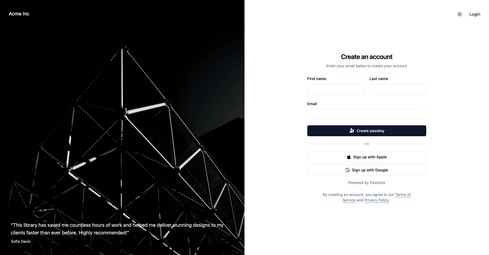

<!-- PROJECT LOGO -->
<div align="center">
  <a href="https://github.com/passlock-dev/passkeys-frontend">
    
  </a>
</div>

<a name="readme-top"></a>

<h1 align="center">SvelteKit Passkey Template</h1>
  <p align="center">
    SvelteKit template project featuring Passkey authentication, Google sign in and mailbox verification.
    <br />
    <a href="https://d1rl0ue18b0151.cloudfront.net">Demo (Master/Preline)</a> &nbsp; | &nbsp; <a href="https://dbr4qrmypnl85.cloudfront.net">Demo (Shadcn branch)</a>
  </p>
</div>

<div align="center">
  <picture align="center">
    <source srcset="static/repo-banner.dark.svg" media="(prefers-color-scheme: dark)" />
    
  </picture>
</div>

# Features

1. Passkey registration and authentication
2. Google sign in / one-tap
3. Mailbox verification (via a one time code or link)
4. Dark mode with theme selection (light/dark/system)
5. [Preline][preline] and [Shadcn][shadcn-svelte] variants

# Screenshots


<p align="center">Creating a new account and passkey</p>

<br />



<p align="center">Shadcn/ui variant (dark mode)</p>

# Frameworks used

1. [Passlock][passlock] - Serverless passkey platform
2. [Superforms][superforms] - Makes form handling a breeze
3. [Lucia][lucia] - Robust session management
4. [Tailwind][tailwind] - Utility-first CSS framework
5. [Preline][preline] - Tailwind UI library <sup>1</sup>
6. [shadcn-svelte][shadcn-svelte] - Tailwind components for Svelte <sup>2</sup>
7. [Melt UI][meltui] - Headless component library for Svelte

<sup>[1]</sup> Uses native Svelte in place of Preline JavaScript  
<sup>[2]</sup> See the [shadcn branch](#shadcnui-variant)

<p align="right">(<a href="#readme-top">back to top</a>)</p>

# About

Pretty much every web application requires authentication and authorization. The future of web authenticaton lies in passkeys, and this starter app makes full use of them. Learn how to register and authenticate your users using passkeys, perform facial or fingerprint recognition and more. You'll also learn how to use some of SvelteKit's hottest libraries and implement Google's latest social sign in feature.

# Demos

I've deployed 2 live versions of this project:

- [Master demo](https://d1rl0ue18b0151.cloudfront.net) - A version of the master branch (uses Preline + Melt UI)

- [Shadcn demo](https://dbr4qrmypnl85.cloudfront.net) - A version of the shadcn branch (uses shadcn-svelte)

# Getting started

## Prerequisites

This example project uses the cloud based Passlock framework for passkey registration and authentication. Create a free account at [passlock.dev][passlock-signup]

## Clone this repo

`git clone git@github.com:passlock-dev/svelte-passkeys.git`

## Install the dependencies

```
cd svelte-passkeys
npm install
```

## Set the environment variables

You'll need to set four variables:

1. PUBLIC_PASSLOCK_TENANCY_ID
2. PUBLIC_PASSLOCK_CLIENT_ID
3. PASSLOCK_API_KEY
4. PUBLIC_GOOGLE_CLIENT_ID <sup>1</sup>

<sup>[1]</sup> - If you don't wish to use Google sign in/One tap set this variable to an empty string

Your Passlock tenancy id, client id and api key (token) can be found in your [Passlock console][passlock-console] under [settings][passlock-settings] and [API Keys][passlock-apikeys]. Please see the section [Sign in with google](#sign-in-with-google) if using Google sign in.

Create a `.env.local` file containing the relevant credentials.

Alternatively you can download a ready made .env file from your passlock console [settings][passlock-settings]:

`Tenancy information -> Vite .env -> Download`

<p align="right">(<a href="#readme-top">back to top</a>)</p>

# Usage

Start the dev server

`npm run dev`

**Note:** by default this app runs on port 5174 when in dev mode (see [vite.config.ts](vite.config.ts))

## Register a passkey

Navigate to the [home page](http://localhost:5174/) page and complete the form. Assuming your browser supports passkeys (most do), you should be prompted to create a passkey.

## Authenticate

Logout then navigate to the [login](http://localhost:5174/login) page. You should be prompted to authenticate using your newly created passkey.

<br />

> [!TIP]
> Prompting for an email address during authentication is optional but **highly recommended**.
>
> Imagine the user hasn't created a passkey, or they signed up using Google. When they try to sign in using a passkey you might expect that they would receive an error telling them that no passkey can be found, but unfortunately that's not how browsers behave. Instead the browser/device will prompt them to use a passkey on another different device. In my experience this confuses 90% of users.
>
> By asking for an email address we can check if they have a passkey registered in the backed or they have a linked Google account. This allows us to display a helpful message telling them to either sign up or login using their Google credentials.

<p align="right">(<a href="#readme-top">back to top</a>)</p>

# Sign in with Google

This app also allows users to register/sign in using a Google account. It uses the latest [sign in with google][google-signin] code, avoiding redirects.

## Adding Google sign in

1. Obtain your [Google API Client ID][google-client-id]
2. Update your `.env` or `.env.local` to include a `PUBLIC_GOOGLE_CLIENT_ID` variable.
3. Record your Google Client ID in your [Passlock settings][passlock-settings]: Social Login -> Google Client ID

> [!IMPORTANT]  
> Don't forget the last step!

## Testing Google sign in

If all went well you should be able to register an account and then sign in using your Google credentials.

**IMPORTANT!** If you previously registered a passkey using the same email address that you wish to use for Google, you'll need to first delete the user in your Passlock console. This starter project doesn't support account linking although we may update it in the future to illustrate this.

<p align="right">(<a href="#readme-top">back to top</a>)</p>

# Mailbox verification

This starter project also supports mailbox verification emails (via Passlock):


You can choose to verify an email address during passkey registration. Take a look at [src/routes/(other)/+page.svelte](<src/routes/(other)/+page.svelte>):

```typescript
// Email a verification link
const verifyEmailLink: VerifyEmail = {
  method: 'link',
  redirectUrl: String(new URL('/verify-email', $page.url))
}

// Email a verification code
const verifyEmailCode: VerifyEmail = {
  method: 'code'
}

// If you want to verify the user's email during registration
// choose one of the options above and take a look at /verify/email/+page.svelte
let verifyEmail: VerifyEmail | undefined = verifyEmailCode
```

## Customizing the verification emails

See the emails section of your [Passlock console][passlock-settings]

<p align="right">(<a href="#readme-top">back to top</a>)</p>

# Shadcn/ui variant


<p align="center">Shadcn/ui variant</p>

The default (master) branch uses [Preline][preline], however a [shadcn-svelte] variant is also available:

```bash
git checkout -b shadcn origin/shadcn
```

**IMPORTANT**: When switching between branches please re-install the NPM dependencies:

```bash
rm -r node_modules pnpm-lock.yaml
pnpm install
```

<p align="right">(<a href="#readme-top">back to top</a>)</p>

# Documentation

Please see the [developer docs](./docs/intro.md)

# Questions? Problems

Please file an [issue][issues] and I'll respond ASAP.

[passlock]: https://passlock.dev
[lucia]: https://lucia-auth.com
[tailwind]: https://tailwindcss.com
[preline]: https://preline.co
[meltui]: https://melt-ui.com
[shadcn-svelte]: https://www.shadcn-svelte.com
[passlock-signup]: https://console.passlock.dev/register
[passlock-console]: https://console.passlock.dev
[passlock-settings]: https://console.passlock.dev/settings
[passlock-apikeys]: https://console.passlock.dev/apikeys
[google-signin]: https://developers.google.com/identity/gsi/web/guides/overview
[google-client-id]: https://developers.google.com/identity/gsi/web/guides/get-google-api-clientid#get_your_google_api_client_id
[issues]: https://github.com/passlock-dev/svelte-passkeys/issues
[superforms]: https://superforms.rocks
[apple-verification-codes]: https://www.cultofmac.com/819421/ios-17-autofill-verification-codes-safari-mail-app/
